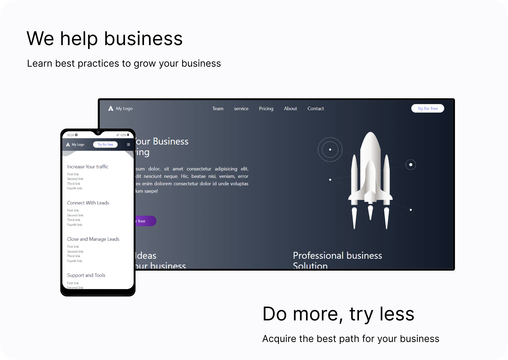

# Grow you business

<p align="center">

</p>


## :bookmark_tabs:Summary

1. [Introduction](#Introduction)
2. [Demo](#live-demo)
3. [Gif ](#features-and-demo)
4. [Run the project](#run-project)
5. [Customization project](#custom-project)


<div id="Introduction">
</br>

## :page_facing_up:Introdução
A landing page website template was used as a starting point, from that, something similar was developed using tailwindcss, the intention was to verify the practicality that the framework offers.
```All datas are static```

</div>
</br>

<div id="live-demo">

You can see the project running at the link below.
### :camera: [LIVE DEMO](https://course-page-tailwindcss.vercel.app/) :video_camera:
</div>
</br>

<div id="features-and-demo">

## :checkered_flag: Gif's
See the behavior of this application running on desktop and mobile.

### Desktop
<p>Project running on a desktop screen</p>

<br/><br/>

### Mobile
<p>Project running on a mobile screen</p>

<br/><br/>

<div id="run-project">
</br>

## :running: Run the project
Open the ````index.html```` file and run it.
</div>
</br>

<div id="custom-project">

## :customs: Customization project
When you make some change in your ````index.html```` file, you should execute the following command to update/create the ````output.css```` file.

    npx tailwindcss -i ./src/input.css -o ./build/output.css --content="./*.html" --watch
</div>
</br>

</br>
</br>

made with :heart: by Jabes Enock
